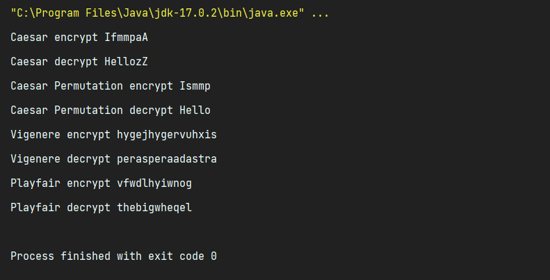

# Topic: Intro to Cryptography. Classical ciphers. Caesar cipher.

### Course: Cryptography & Security
### Professor: Vasile Drumea
### Student: Scripca Lina

----

## Theory
&ensp;&ensp;&ensp; Cryptography consists a part of the science known as Cryptology. The other part is Cryptanalysis. There are a lot of different algorithms/mechanisms used in Cryptography, but in the scope of these laboratory works we will need to get familiar with some examples of each kind.

&ensp;&ensp;&ensp; First, it is important to understand the basics so for the first task we will need to implement a classical and relatively simple cipher. This would be the Caesar cipher which uses substitution to encrypt a message.

&ensp;&ensp;&ensp; In it's simplest form, the cipher has a key which is used to substitute the characters with the next ones, by the order number in a pre-established alphabet. Mathematically it would be expressed as follows:

$em = enc_{k}(x) = x + k (mod \; n),$

$dm = dec_{k}(x) = x + k (mod \; n),$

where:
- em: the encrypted message,
- dm: the decrypted message (i.e. the original one),
- x: input,
- k: key,
- n: size of the alphabet.

&ensp;&ensp;&ensp; Judging by the encryption mechanism one can conclude that this cipher is pretty easy to break. In fact, a brute force attack would have __*O(nm)*__ complexity, where __*n*__ would be the size of the alphabet and __*m*__ the size of the message. This is why there were other variations of this cipher, which are supposed to make the cryptanalysis more complex.

&ensp;&ensp;&ensp;A way to add complexity to this cypher would be to use a permutated alphabet. This type of Caesar Cypher can also be denoted as Caesar Permutation Cypher. The mechanism of its implementation is defined by the insertion of a keyword before the alphabet to add entropy to the base letter order, after which, using the newly acquired alphabet the previously explained classical substitution is performed for 
each letter in the plain text.

&ensp;&ensp;&ensp; However, despite this addition, the Caesar Permutation cypher is still vulnerable 
before letter frequency analysis, as it's a monoalphabetic cypher, 
which means that the original letter can be guessed by the frequency of its 
substituent within the cyphertext. As the most common english letter is e(13%, compared to t which is second and takes the share of 9%), if it were to be substituted by x, it's number of repetitions in our message would betray its original value.

&ensp;&ensp;&ensp;A better alternative to Caesar Permutation cypher would be the Vigenere cypher, which is polyalphabetic.
The Vigenere, just like the modified Caesar makes use of a keyword, but instead of being introduced within an alphabet, the keyword is repeated
enough time to match the letters of the message, after which to each letter from the message is added the value of the keyword letter underneath it to obtain the cyphertext.

&ensp;&ensp;&ensp;Ex: Message = PERASPERAADAASTRA

&ensp;&ensp;&ensp;Message values = 15 4 17 0 18 15 4 17 0 0 3 0 18 19 17 0

&ensp;&ensp;&ensp;Keyword= SUPERSUPERSUPERS

&ensp;&ensp;&ensp;Keyword Values = 18 20 15 4 17 18 20 15 4 17 18 20 15 4 17 18

&ensp;&ensp;&ensp;Cyphertext Values = 7 24 6 4 9 7 24 6 4 17 21 20 7 23 8 18

&ensp;&ensp;&ensp;Cyphertext = H Y G E J H Y G E R V U H X I S

&ensp;&ensp;&ensp;As one can see, the letter A is mapped to more than one other letter, going from E to R, which makes guessing it a lot more difficult without the key.

&ensp;&ensp;&ensp;Another, more exotic cypher would be the Playfair Cypher, which uses a 5x5 square for the mapping of the alphabet, skipping over a less used letter like Q or Z or grouping I and J together to achieve its form. Like the Caesar Permutation, it also employs an 
additional key before the creation of the square. It is a digraph substitution cypher, encrypting digraphs instead of single letters in each iteration.

&ensp;&ensp;&ensp;First, the key is placed, then the square is created. After which, the message is separated into digraphs. If the message has two identical letters in a digraph, they are separated through a 
bogus letter (usually q or z), and the second identical letter is analysed within another digraph. If the message has an odd number of letters, then a bogus letter may also be added at the end of it.

&ensp;&ensp;&ensp; After the preparations, each digraph is taken and modified according to the square. 
- If the letters are on the same row, they are mapped to the letters on their right.
- If the maps are in the same column, they are mapped to the letter underneath them.
- If the letters are on different rows and columns, a rectangle is drawn using the column and row coordinates, where the values of the corners that dont belong to the original digraphs are selected as substitute (based on row placement)

ex: .png)

&ensp;&ensp;&ensp;In the following chapters an implementation in Kotlin of those algorithms will be described.


## Objectives:
1. Get familiar with the basics of cryptography and classical ciphers.

2. Implement 4 types of the classical ciphers:
    - Caesar cipher with one key used for substitution (as explained above),
    - Caesar cipher with one key used for substitution, and a permutation of the alphabet,
    - Vigenere cipher,
    - Playfair cipher.


## Implementation:

### Classical Caesar Cypher
&ensp;&ensp;&ensp;The first program shows the implementation of the Caesar Cypher that saves the case of the letters in the message:
```
class CaesarCypher(var key:Int) {
    fun encrypt(m:String) : String{
        var cyphertext=""
        var plaintext = m.lowercase()
        for (c in 0 until plaintext.length){
            var letter = if((plaintext[c]+key).isLetter()) (plaintext[c] + key).toString() else ((plaintext[c]+key) -'z' + 96).toChar().toString()
            cyphertext += if(m[c].isUpperCase()) letter.toUpperCase() else letter
        }
        return cyphertext
    }
    
    fun decrypt(m:String):String {
        var plaintext = ""
        var cypherText = m.lowercase()
        for (c in 0 until cypherText.length) {
            var letter =
                if ((cypherText[c] - key).isLetter()) (cypherText[c] - key).toString() else ((cypherText[c] - key) + 'z'.toInt() - 96).toChar()
                    .toString()
            plaintext += if (m[c].isUpperCase()) letter.toUpperCase() else letter
        }
        return plaintext
    }

}
```
&ensp;&ensp;&ensp; First for the encryption the text is traced to lowercase for ease of work, then each letter from the message is 
substituted using the key in ASCII codification. If the substituent is not a letter, then the obtained character gets 'z's code reduced from itself, and then a's code added back to ensure a circular mapping
of the alphabet. Then the obtained letter is transfered to the cyphertext and its case is changed upon need.

&ensp;&ensp;&ensp;The decryption is similar, only the key and a's code is substracted from the message character, and z's code is added. 

### Permutation Caesar Cypher
&ensp;&ensp;&ensp; As described before, a substitution technique is also used within it, but instead of employing the original alphabet, a separate one needs to be created.
For that, first within the constants the base alphabet is declared as a string for ease of use.
and then as shown below one by one, unique characters from the set permutation key are used to populate the alphabet
and then the rest of the missing letters are added from the constant alphabet string.
```
 fun setAlphabet(permutation:String){
        permutatedAlphabet = ""
        for (c in permutation) if (!(c in permutatedAlphabet)) permutatedAlphabet+=c.lowercase()
        for (c in Constants.ALPHABET) if (!(c in permutatedAlphabet)) permutatedAlphabet+=c
    }
```
&ensp;&ensp;&ensp; Then, the same procedure as in the classical cypher is used, only instead of using ASCII to find the substituent,
their indices within the Permutated alphabet are used.

```
override fun encrypt(m: String):String{
        if (!this::permutatedAlphabet.isInitialized) setAlphabet(permutation)
        var plaintext = m.lowercase()
        var cyphertext = ""
        for (c in 0 until plaintext.length){
            cyphertext+= if(m[c].isUpperCase()) permutatedAlphabet[(permutatedAlphabet.indexOf(plaintext[c])+key) %Constants.ALPHABET_SIZE].uppercase() else
                permutatedAlphabet[permutatedAlphabet.indexOf(plaintext[c])+key]
        }
        return cyphertext
    }
```
&ensp;&ensp;&ensp; The decryption is similar, only instead of adding the key, it is substracted.
```
 plaintext+= if(m[c].isUpperCase()) permutatedAlphabet[(permutatedAlphabet.indexOf(cyphertext[c])-key) %Constants.ALPHABET_SIZE].uppercase() else
                permutatedAlphabet[(permutatedAlphabet.indexOf(cyphertext[c])-key) %Constants.ALPHABET_SIZE]
```
### Vigenere Cypher
&ensp;&ensp;&ensp; As was mentioned previously, the Vigenere cypher has a pretty straightforward implementation. Each letter from the message is searched for its index within the alphabet constant, and then added to the appropriate index of letter from the key.
In this case, however, instead of repeating the key several times within a String,
the letter to be added to the current character in the message is calculated using the expression:

(index of char) mod length of the key.

```
class VigenereCypher(var key: String) :Cypher() {
    override fun encrypt(m:String):String{
        var cyphertex t =  "" 
        var plaintext = m.lowercase()

        for (c in 0 until plaintext.length){
            var ctm = Constants.ALPHABET.indexOf(plaintext[c])
            var k = Constants.ALPHABET.indexOf(key[(c % key.length)])
            cyphertext+= if(m[c].isUpperCase()) Constants.ALPHABET[(ctm + k) % Constants.ALPHABET_SIZE].uppercase()
        else Constants.ALPHABET[(ctm + k) % Constants.ALPHABET_SIZE]
        }
        return cyphertext
    }

    override fun decrypt(m:String):String{
        var plaintext = ""
        var cyphertext = m.lowercase()
        for (c in 0 until cyphertext.length){
            var ctm = Constants.ALPHABET.indexOf(cyphertext[c])
            var k = Constants.ALPHABET.indexOf(key[(c % key.length)])
            plaintext+= if(m[c].isUpperCase()) Constants.ALPHABET[Math.floorMod((ctm - k), Constants.ALPHABET_SIZE)].uppercase()
            else Constants.ALPHABET[Math.floorMod((ctm - k), Constants.ALPHABET_SIZE)]
        }

        return plaintext
    }
}
```
&ensp;&ensp;&ensp; The decryption is similar, except the appropriate key letter is subtracted from the cypher message.

###Playfair Cypher
&ensp;&ensp;&ensp; The playfair cypher has a more unusual implementation. First the permutated alphabet is declared and ten created just like in the Caesar Permutation Cypher.
```
    override var permutatedAlphabet:String = ""
    var wheel=Array(5){CharArray(5)}

    override fun setAlphabet(permutation: String){
        super.setAlphabet(permutation)
        this.permutatedAlphabet = this.permutatedAlphabet.replace("j", "")
        var i = 0
        for (row in 0 until wheel.size)
            for (col in 0 until wheel[row].size){
                wheel[row][col] = permutatedAlphabet[i]
                i++
            }
    }
```
&ensp;&ensp;&ensp; However, instead of leaving it as is, the letter j is removed from the alphabet and the mapping wheel (5x5 array of Chars) is created.

&ensp;&ensp;&ensp; Then the message up for encryption is modified to fit the 
needed format. Spaces are deleted, as well as the letter j changed to i. Then each pair of letters
is analysed on wherever it's an illegal digraph(two identical letter) or wherever the message has an odd number of letters.
The message is then padded accordingly with bogus letters like q or z to fit the need.
```
        var message = m.lowercase().replace(" ", "")
        if ("j" in message) message.replace("j", "i")
        var c :Int= 0
        while (c < message.length){
            if (c + 1 == message.length ) {
                message+= message[c].toString() + if(message[c] != 'q')  "q" else "z"
            break}
            else if(message[c] == message[c+1]) message= message.substring(0, c+1) + (if(message[c] != 'q')  "q" else "z") + message.substring(c+1)
            c+=2
        }
```
&ensp;&ensp;&ensp; After that the cyphertext is declared and each sanitized bigraph is analyzed within the context of the wheel and 
added to the cyphertext.
```
var cyphertext = ""
        c= 1
        while (c < message.length){
            cyphertext+= getCypher(message[c-1], message[c], false)
            c+=2

        }
        return(cyphertext)
```
&ensp;&ensp;&ensp; There, each letter's row and column is found, and then the digraph's locations are compared according to the rules
mentioned in the Theory section.
```
private fun getCypher(i:Char, j:Char, isDecryption:Boolean):String{
        var move = if(isDecryption) (-1) else 1
        var irow = 0
        var icol = 0
        var jrow = 0
        var jcol = 0

        while(irow< wheel.size){
            if(i in wheel[irow]) {
                icol = wheel[irow].indexOf(i)
                break
            } else irow++
        }

        while(jrow< wheel.size){
            if(j in wheel[jrow]) {
                jcol = wheel[jrow].indexOf(j)
                break
            } else jrow++
        }

        if (jrow == irow) return wheel[irow][Math.floorMod(icol+move, 5)].toString() + wheel[irow][Math.floorMod(jcol+move, 5)].toString()
        else if (jcol == icol) return wheel[Math.floorMod(irow +move, 5)][icol].toString() + wheel[Math.floorMod(jrow+move,5)][jcol].toString()
        else{
            var newi = wheel[irow][jcol]
            var newj = wheel[jrow][icol]
            return newi.toString() + newj.toString()
        }
    }
```
&ensp;&ensp;&ensp; The decryption of the algorithm is easier,with the value for the *move* variable changing from 1 to -1, o account for the movement backwards, in the opposite direction of the encryption.




## Conclusion
&ensp;&ensp;&ensp; Although the development of Cryptography has moved forward
and the Classical Cyphers have been broken long ago, they still hold an important place in history 
and are worth having their mechanisms be studied, as one cannot progress without knowing the basics. 
